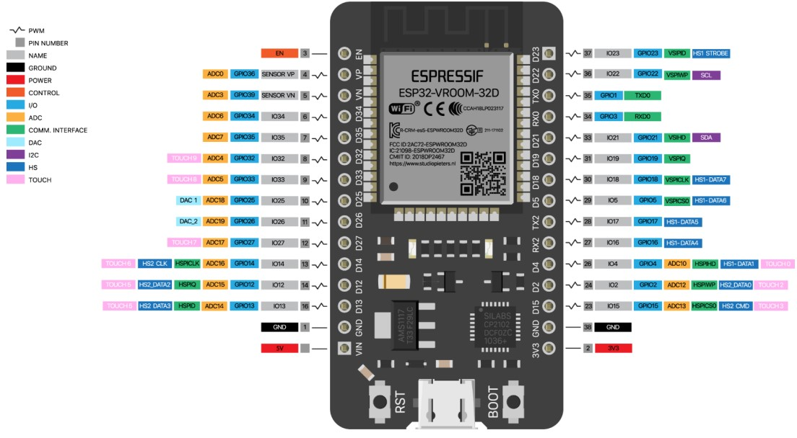
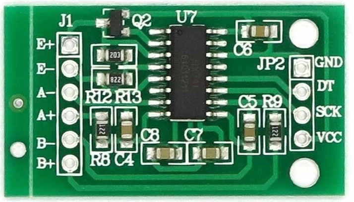
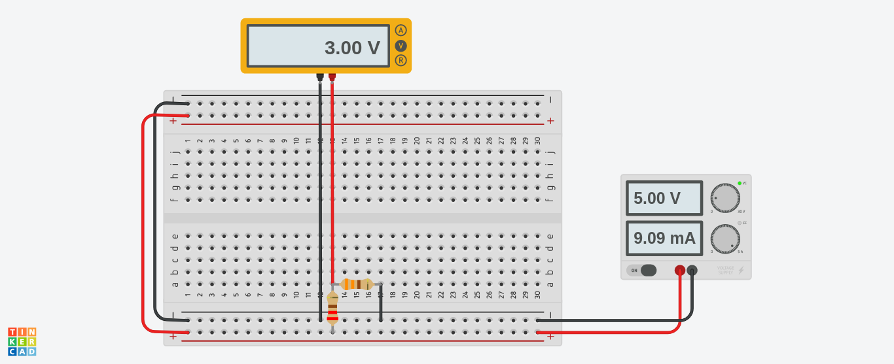

- [Serial_esteira](#branch-serial-esteira)
- [Hardware e Esquemas Elétricos](#hardware-e-esquemas-elétricos)
  - [ESP32](#esp32)

# Branch: Serial esteira 
Essa branch foi especialmente dedicada ao funcionamento do braço de forma integrada com uma esteira seletora, feita pela primeira turma de Sistemas Embarcados, na Fatec Jundiaí.

Além de modificações no código, essa parte do projeto também contém modificações na parte de harware do projeto.

Além disso, adicionamos uma caixa de coleta ao final do projeto, onde o robô larga as peças depois de receber as ordens da esteira, onde foi adicionado um sensor de peso para o esp saber quantas peç  as foram coletadas ao final do fluxo da esteira.

Segue um vídeo do nosso projeto para melhor entendimento:

[Clique aqui se preferir ver no youtube](https://www.youtube.com/watch?v=XmaUbG7Ou1w)

# Hardware e Esquemas Elétricos
## ESP32

O projeto segue o mesmo esquema elétrico, com excessão dos módulos que foram adicionados.

Um sensor de peso foi adicionado ao circuito, para ser possível saber se a peça chegou ao seu destino corretamente.

No nosso caso, o sensor utilizado foi o HX711.

Os pinos foram ligados no esp32 da seguinte forma:
 - No pino 4: O pino SCK do sensor;
 - No pino 15: O pino DOUT do sensor.

A comunicação entre a esteira (programada usando Arduino) seletora e o ESP32 foi feito via serial, onde:
  - No pino 26: o pino TX da esteira;
  - No pino 25: o pino RX da esteira.
___
 - *Obs: Os sinais enviados do Arduino são enviados com uma tensão de 5v, enquanto o esp funciona no máximo com 3.3v. Ou seja, é necessário um circuito de redução de tensão, usando um resistor de 220Ω na saída do TX do arduino, e 330Ω ligado ao GND, e o RX do esp32 deve ficar entre esses dois resistores, como no circuito abaixo:*

- *Considere o positivo da fonte como o TX do Arduino, e o negativo como o GND.*
- *Além disso, observe como a tensão de entrada é 5v e a de saída é 3v.*
___

Além disso, a parte de hardware não difere mais em relação à branch main.